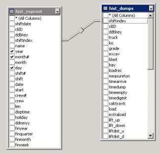
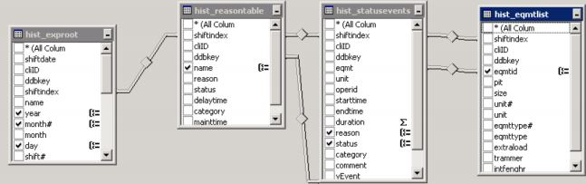

```{r setup, include=FALSE}
knitr::opts_chunk$set(echo = TRUE)
library(magrittr)
library(kableExtra)
```

***
### Relatório Ana Carla Campelo - Doutoranda Engenharia de Minas

#### Objetivo Principal:

- Estimar a produtividade de transporte dos equipamentos utilizados nas minas a curto e longo prazo;

#### Variáveis Desfecho:

##### Desfecho Primário:
- Distância Média de Transporte

##### Desfecho Secundário:

- Velocidade Média
- Produtividade
- Massa Transportada

#### Plano de Análise: 

Para o plano de lavra mensal ocorre a coleta de dados direto do sistema de despacho em um período de até 4 meses, onde é dado maior peso nos dados do mês imediatamente anterior ao momento da execução do plano mensal. Os valores das variáveis de tempo, como por exemplo as Hora Trabalhada, assim como os valores da Produção são retiradas de um diagram de consultas SQL e estão prontas para logo serem utilizadas nas equações de interesse para estimação de produtividade. Para alcançar o detalhamento necessário no dimensionamento de produtividade de transporte para o plano de lavra mensal, esses dados foram estratificados por equipamento de carga, frota de transporte, local de carregamento e local de basculamento.

<center>

  

<center>

#### Metodologia de Análise Estatística Proposta
Como as variáveis já estão estratificadas e organizadas de acordo com o sistema de despacho, propõe-se uma ........ para cada equipamento que se deseja estimar os parâmetros de interesse. Além disso, esse tipo de análise escolhido pode se estender para o Local de Basculamento assim como outras estratificações impostas pela empresa.      

Junto com ......... devem ser estimados Intervalos de Confiança com o principal propósito de fornecer dados para a tomada de decisão, além de que se estabeleça uma margem de erro para o método de previsão utilizado em nossas variáveis de interesse.


#### Anexos
##### Dicionário de Dados:
$$
\begin{array}{|l |ll|lc|}\hline
\textbf{Código da Variável} && \textbf{Nome}&& \textbf{Unid. de Medida / Escala}\\ \hline
\text{TVV}   && \text{Tempo de Viagem Vazio} && \text{Horas} \\
\text{TFC} && \text{Tempo de Fila para Carregar} && \text{Horas} \\
\text{TMC} && \text{Tempo de Manobra para Carregar}  && \text{Horas}   \\
\text{TC} && \text{Tempo de Carregamento}&& \text{Horas}    \\
\text{TVC} && \text{Tempo de Viagem Cheio} && \text{Horas}      \\
\text{TFB} && \text{Tempo de Fila para Bascular} && \text{Horas}       \\
\text{TMB} && \text{Tempo de Manobra para Bascular} && \text{Horas}          \\
\text{TB} && \text{Tempo de Basculamento} && \text{Horas}\\
\text{CM} && \text{Carga Média}&& \text{TON}\\
\text{LOCC} && \text{Local de Carregamento}&& - \\
\text{LOCB} && \text{Local de Basculamento}&& -\\
\text{HT} && \text{Hora Trabalhada}&& \text{Horas}\\
\text{DMT} && \text{Distância Média de Transporte}&& \text{Km}\\
\text{VEL} && \text{Velocidade}&& \text{km/h}\\
\text{PROD} && \text{Produtividade}&& \text{TON/h}\\
\text{PMB}  && \text\\
\text{MASS}  && \text{Massa} && \text{TON}\\
\hline
\end{array}
$$

##### Exemplo de Tabulação: 
```{r, echo = FALSE}
x = c(43424.2,14214.5,873487.98)
y = c(2.56,3.30,2.62)
z = c(356,265,232)
w = c(18.84,17.8,15.9)
df = data.frame(Massa = x,
                DMT = y,
                Produtividade = z,
                Velocidade = w,
                row.names = c('ESC1','ESC2','ESC3'))
knitr::kable(df)%>%row_spec(0, background = "black", color = "white")%>%column_spec(1,background = 'orange', color = 'black')%>%kable_styling(bootstrap_options = c("striped", "bordered", "condensed")) 
```

