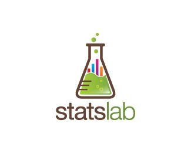

# lab_est_1_mat02031
### Este repositório contém os programas utilizados durante a disciplina **Laboratório de Estatística  I**, cursada em 2020/1, ministrada pelo professor Rodrigo Citton Padilha dos Reis.

 
 
 
 
 
 
 
 
 
 
 
 
 
 
 
 
 
 
 
 
 
 
 
 
 
 
 
 
 
 

