# lab_est_1_mat02031
#### Este repositório contém os programas utilizados durante a disciplina **Laboratório de Estatística  I**, cursada em 2020/1, ministrada pelo professor Rodrigo Citton Padilha dos Reis.

 
 
 
 

As seguintes etapas compõem os planos de análise e relatórios:

- Apresentação: informações do cliente e turma, prelúdio do plano de análise;
- Objetivos: definição do escopo, objetivos primários e secundários da pesquisa em questão;
- Delineamento: detalhamento de como foram / serão feitas as etapas da pesquisa;
- Variáveis: definição da variável resposta / desfecho e suas covariáveis;
- Análise Estatística: sugestão de análise estatística para cada caso ou avaliação dos métodos aplicados, caso a pesquisa já tenha passado por esta etapa;
- Anexos: Sugestão de tabulação dos dados e Dicionário de Dados, quando couber.

 

### Fluxo de Trabalho:

 
 
 
 
 
 
 
 
 
 
 
 
 
 
 
 
 
 
 
 
 
 
 
 
 

